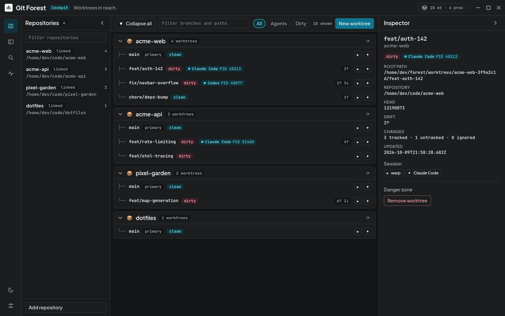
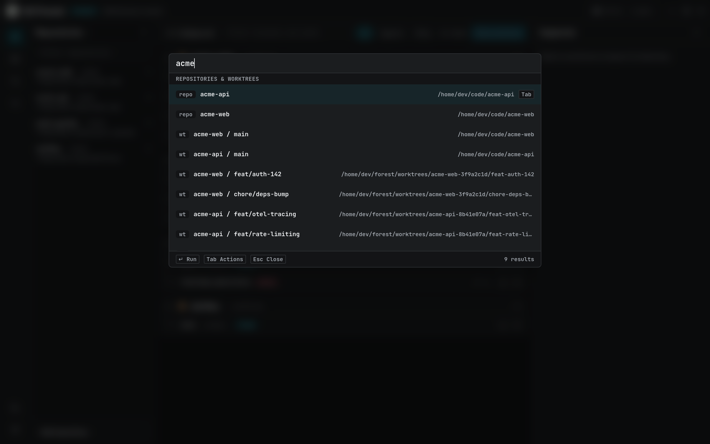
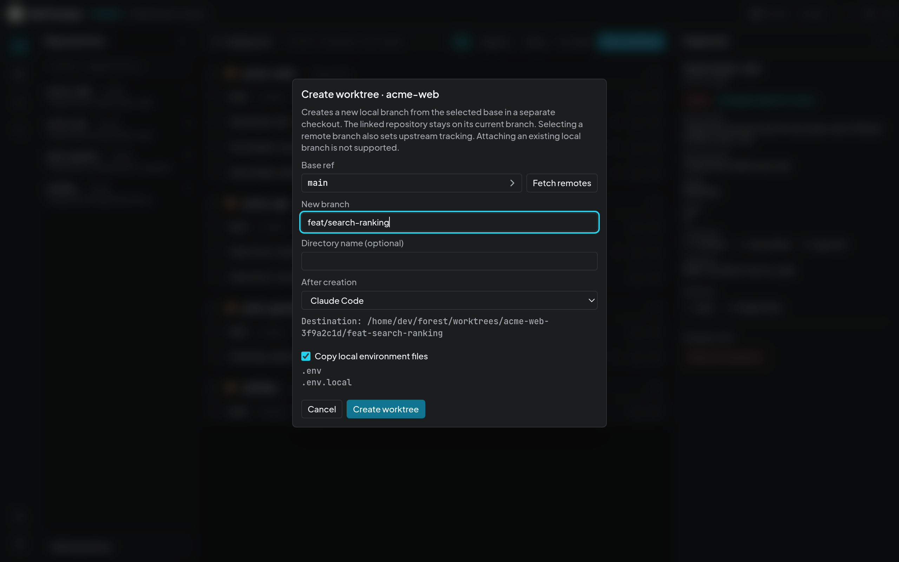
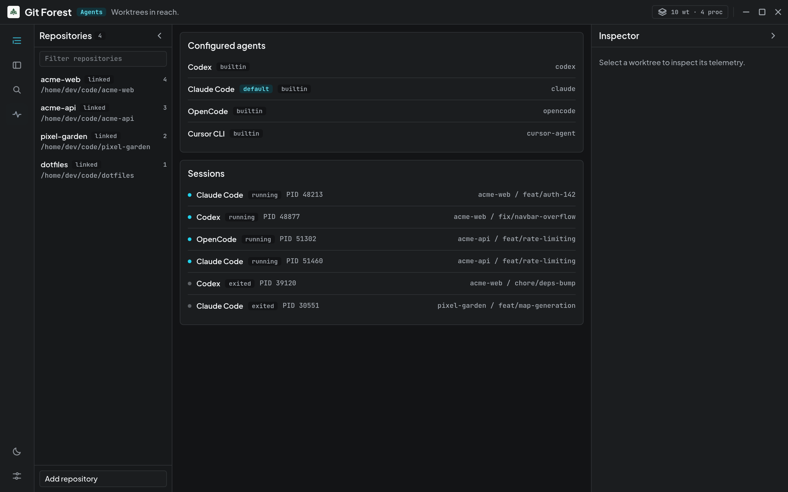
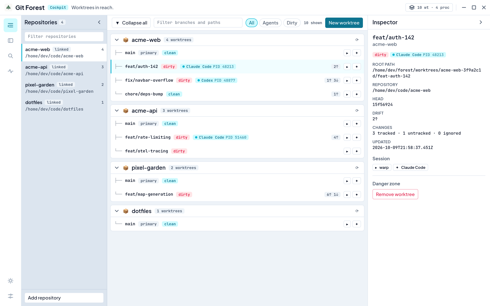

<div align="center">


# Git Forest

**Keyboard-first desktop control plane for Git worktrees and CLI coding agents.**

[](https://github.com/titobsala/git-forest/actions/workflows/ci.yml)
[](LICENSE)


</div>



Running several coding agents in parallel means juggling many isolated checkouts: one worktree per task, each with its own terminal and its own agent. Git Forest keeps track of all of them. From one keyboard-driven window you can find any repository or worktree, create a new isolated worktree from a local or remote branch, open it in your terminal, launch Codex, Claude Code, or OpenCode inside it, see which agents are still running, and safely clean up when the work is done.

Git Forest is **not** a Git client, IDE, or terminal. It is the layer that connects them.

## Features

- **Quick Launch from anywhere.** `Super + W` summons a fuzzy launcher over every indexed repository and worktree, ranked by recent use. `Enter` opens the worktree in your terminal.
- **Worktree lifecycle.** Create a worktree on a new branch from any local or remote-tracking ref, with optional copying of ignored `.env` files. Remove it with a safety preview that blocks on uncommitted changes, untracked files, or running agents.
- **Agent sessions.** Launch a CLI coding agent in a worktree with `⌥ A`. Forest tracks each session against Linux `/proc`, survives restarts, and never shows stale state as live.
- **Works with your existing repositories.** Link repositories where they already live, or scan a folder to import many at once. Forest never moves your code, and it tolerates `git worktree add/remove` done outside the app.
- **Resilient by design.** Missing, moved, or invalid checkouts are detected and can be relocated. A maintenance view previews and prunes stale metadata without touching present directories.
- **Light and dark themes**, a dense cockpit view, and an inspector for per-worktree telemetry.

<table>
  <tr>
    <td width="50%"></td>
    <td width="50%"></td>
  </tr>
  <tr>
    <td align="center"><b>Quick Launch</b>: fuzzy search across every worktree</td>
    <td align="center"><b>New worktree</b>: branch from local or remote refs, launch an agent</td>
  </tr>
  <tr>
    <td width="50%"></td>
    <td width="50%"></td>
  </tr>
  <tr>
    <td align="center"><b>Agent monitor</b>: live and finished sessions</td>
    <td align="center"><b>Light theme</b></td>
  </tr>
</table>

## Keyboard

| Shortcut                | Action                                      |
| ----------------------- | ------------------------------------------- |
| `Super + W`             | Show/hide Quick Launch from any application |
| `Ctrl + K`              | Toggle Quick Launch while Forest is focused |
| `↑` / `↓`               | Move through worktrees                      |
| `Enter`                 | Open the selected worktree in the terminal  |
| `⌥ A`                   | Launch the default coding agent in it       |
| `Tab` (in Quick Launch) | Show actions for the highlighted result     |
| `Tab` / `Shift + Tab`   | Toggle the repositories sidebar / inspector |
| `Ctrl + O`              | Back to the cockpit                         |
| `Esc`                   | Close the active overlay                    |

## Status

Git Forest is an **early alpha (0.1.1)**, Linux-first. Current scope:

- **Platform:** Linux. The architecture keeps OS-specific code behind adapters for a later macOS/Windows port.
- **Terminal:** [Warp](https://www.warp.dev/). Other terminals plug in behind the same `TerminalProvider` interface.
- **Agents:** Codex, Claude Code, and OpenCode built in; Cursor CLI is detected. Custom agents are planned.
- **Repositories:** new imports are linked in place. Worktrees always start on a new branch.

See [ROADMAP.md](ROADMAP.md) for what comes next.

## Architecture

```text
┌──────────────────────────────┐
│  React 19 UI (TypeScript)    │   presents state, never runs commands
└──────────────┬───────────────┘
               │ typed, intent-level Tauri commands
               │ (create_worktree, launch_agent, …)
┌──────────────▼───────────────┐
│  Forest core (Rust)          │   domain services, safety checks, reconciliation
└───┬──────────┬──────────┬────┘
    │          │          │
   Git      SQLite     OS / processes
  (CLI)    (metadata)  (/proc, terminal & agent adapters)
```

Some deliberate choices:

- **The UI is a client.** Every privileged action goes through a narrow Rust command. There is no shell plugin and no generic `run_command` exposed to the webview.
- **Git stays authoritative.** Forest runs the user's own `git` with porcelain output, so hooks, credentials, and worktree semantics match the command line exactly.
- **No shell-string building.** Paths and branch names are always passed as separate arguments. The one place a command string is required (Warp tab configs) goes through a small, tested POSIX quoting encoder.
- **Persisted state is never trusted blindly.** Repositories, worktrees, and agent sessions are reconciled against the filesystem, Git, and `/proc` on startup and refresh. PID reuse is detected through process start ticks.
- **Adapters at the edges.** Terminals (`TerminalProvider`) and coding agents (`AgentRunner`) are trait boundaries, so adding Ghostty or a new agent doesn't touch worktree logic.

The reasoning behind these is recorded in [`docs/decisions/`](docs/decisions/).

## Getting started

### Download

Prebuilt x86_64 Linux packages are attached to each [GitHub Release](https://github.com/titobsala/git-forest/releases/latest):

| Package     | For                                  |
| ----------- | ------------------------------------ |
| `.AppImage` | Any distribution: `chmod +x` and run |
| `.deb`      | Debian, Ubuntu, and derivatives      |
| `.rpm`      | Fedora, openSUSE, and derivatives    |

You also need Git, and [Warp](https://www.warp.dev/) to open worktrees and launch agents. Checksums are in `SHA256SUMS.txt`.

### Build from source

Prerequisites:

- [Bun](https://bun.sh)
- [Rust](https://rustup.rs) (stable, with `clippy` and `rustfmt`)
- Git
- [Warp](https://www.warp.dev/) to open worktrees and launch agents
- Tauri 2 system libraries. On Ubuntu 24.04:

```bash
sudo apt install build-essential curl wget file pkg-config libssl-dev \
  libgtk-3-dev libwebkit2gtk-4.1-dev libayatana-appindicator3-dev \
  librsvg2-dev libxdo-dev
```

Then:

```bash
git clone https://github.com/titobsala/git-forest.git
cd git-forest
bun install
bun run dev        # development app with hot reload
bun run build      # production build
```

Forest stores its metadata in `~/.local/share/dev.gitforest.desktop/`. New worktrees go under `~/forest/worktrees/<repository>-<id>/<branch>`. Linking or removing a repository never moves or deletes your files.

## Development

```bash
bun run test          # frontend tests (Vitest)
bun run typecheck     # TypeScript
bun run lint          # ESLint
bun run format:check  # Prettier
bun run check:rust    # rustfmt, Clippy (-D warnings), cargo test
bun run check         # everything above
```

`bun install` enables a pre-commit hook (`.githooks/`) that formats and lints staged files. CI runs the frontend checks, the Rust checks, and a full Tauri desktop build on every pull request. Pushing a version tag builds the release packages; see [releasing](docs/releasing.md).

Rust tests create throwaway Git repositories to exercise real worktree scenarios: dirty and untracked checkouts, detached HEAD, removed directories, externally created worktrees, and stale metadata. Desktop-only behavior is covered by the [manual QA checklist](docs/testing.md).

### Project layout

```text
apps/desktop/
├── src/                 React UI: app shell, cockpit, launcher, agents, settings
└── src-tauri/
    ├── src/
    │   ├── commands/    Tauri command boundary
    │   ├── forest/      application services (repositories, worktrees, sessions, cleanup)
    │   ├── domain/      domain types and typed errors
    │   ├── git/         Git CLI runner and porcelain parsers
    │   ├── terminals/   TerminalProvider + Warp adapter
    │   ├── agents/      AgentRunner, detection, command encoding
    │   ├── processes/   Linux /proc inspection
    │   ├── persistence/ SQLite repositories
    │   └── platform/    paths and global shortcut
    └── migrations/      versioned SQL schema
docs/                    design spec, decision records, QA checklist
```

### Working with AI coding agents

This project is built with AI coding agents as collaborators. [AGENTS.md](AGENTS.md) holds the rules they follow: architecture boundaries, Git safety, security constraints, and testing expectations.

## License

[MIT](LICENSE) © Tito Sala
